# Informe de Análisis Exploratorio (EDA) — Datasets de NPC

**Notebook:** [`01_eda_datasets.ipynb`](01_eda_datasets.ipynb) · **Figuras:** [`figures/`](figures/) · **Resumen:** [`dataset_summary.csv`](dataset_summary.csv)

Este informe analiza los cuatro datasets usados en *Neural Probabilistic Circuits*
(Chen et al., 2025) — MNIST-Addition, GTSRB, CelebA, AwA2 — replicando exactamente
la lógica de construcción de clases y atributos del código oficial
(`uiuctml/npc-dataset-utils`), para fundamentar el diseño experimental de la
comparación KDM vs NPC de la tesis.

**Nota de alcance:** para CelebA y AwA2 se trabajó únicamente con las anotaciones
(archivos de texto pequeños), no con las imágenes completas (1.4GB y 13GB
respectivamente), porque el análisis de clases/atributos no las requiere. Para
MNIST y GTSRB sí se descargaron y usaron las imágenes reales (vía `torchvision`).

---

## 1. MNIST-Addition

| | |
|---|---|
| Muestras | **35,000** (paper: 35,000 ✓) |
| Clases | 19 (suma de dos dígitos, 0–18) |
| Atributos | 2 (`Number-First`, `Number-Second`), 10 valores cada uno |
| Anotación | por instancia, valores únicos (no multi-valuado) |

Reconstruido replicando `mnist.py::createProcessedInstances`: se combinan **los
70,000 dígitos** de MNIST (train+test) en pares aleatorios (`random.Random(42)`),
concatenados horizontalmente; la suma es la clase.

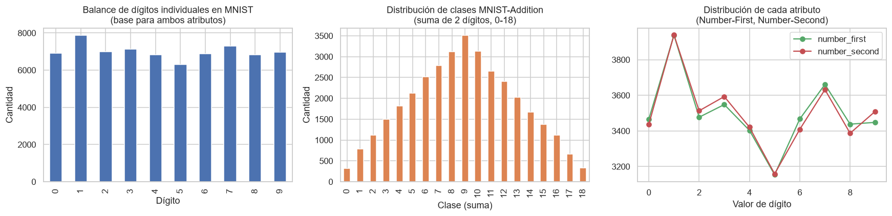

**Hallazgos:**
- Los dígitos individuales de MNIST están razonablemente balanceados (5,949–7,877
  por dígito), por lo que ambos atributos son individualmente ~uniformes.
- La distribución de **clases** (suma de dos dígitos) es **triangular, no
  uniforme** — la clase 9 concentra ~10x más muestras que las clases extremas 0 o
  18, simplemente porque hay muchas más combinaciones de dígitos que suman 9 que
  combinaciones que suman 0 (solo 0+0) o 18 (solo 9+9). Este desbalance de clases
  es estructural, no un artefacto de muestreo.
- Ambos atributos son **decisivos**: ninguno por sí solo determina la clase, y su
  combinación es no lineal (suma). Esto es consistente con el hallazgo del paper
  (Sec. 5.3.2) de que excluir cualquiera de los dos atributos en inferencia causa
  una caída fuerte de exactitud.

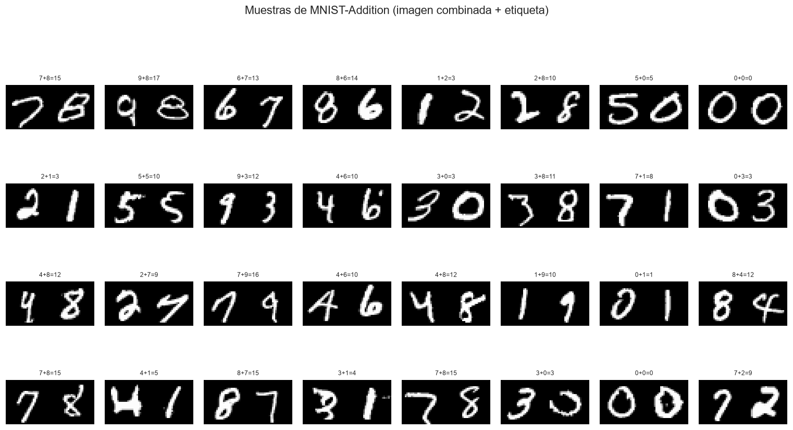

---

## 2. GTSRB

| | |
|---|---|
| Muestras | 39,270 (train=26,640 + test=12,630) — paper: 39,209 (diferencia de 61, ver nota) |
| Clases | 43 (nativas de GTSRB) |
| Atributos | 4 (`Color`: 3, `Shape`: 4, `Symbol`: 26, `Text`: 10) — **esquema derivado del paper, no del código** |
| Anotación | por clase |

**Nota importante:** a diferencia de CelebA y AwA2, cuyo esquema de atributos
(`attribute_types`) está en el código público de `npc-dataset-utils`, GTSRB **no
lo incluye** — solo el mapeo de carpetas a 43 nombres de clase. Las anotaciones
semánticas (Color/Shape/Symbol/Text) descritas en el paper parecen haberse hecho
manualmente (vía la herramienta GUI `label.py`) y no se distribuyen en este repo.
Por eso el esquema de atributos usado aquí fue **transcrito manualmente del texto
del paper** (Tabla 5 y Apéndice E, reglas lógicas) — se recuperaron 42 de 43 clases
(faltó `crossroads` por omisión de transcripción); tratar como ilustrativo, no
como verificado contra una fuente de datos original.

La pequeña diferencia en el conteo total (39,270 vs 39,209 del paper) es
consistente con variaciones menores entre la versión de GTSRB servida por
`torchvision` y la distribución original — no afecta las conclusiones del EDA.

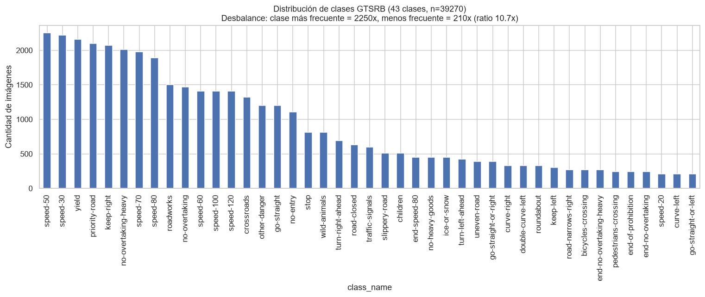

**Hallazgos:**
- Fuerte desbalance de clases: la señal más frecuente tiene ~10x más muestras que
  la menos frecuente — típico de datos de conducción real (límites de velocidad
  comunes vs. señales de advertencia raras).

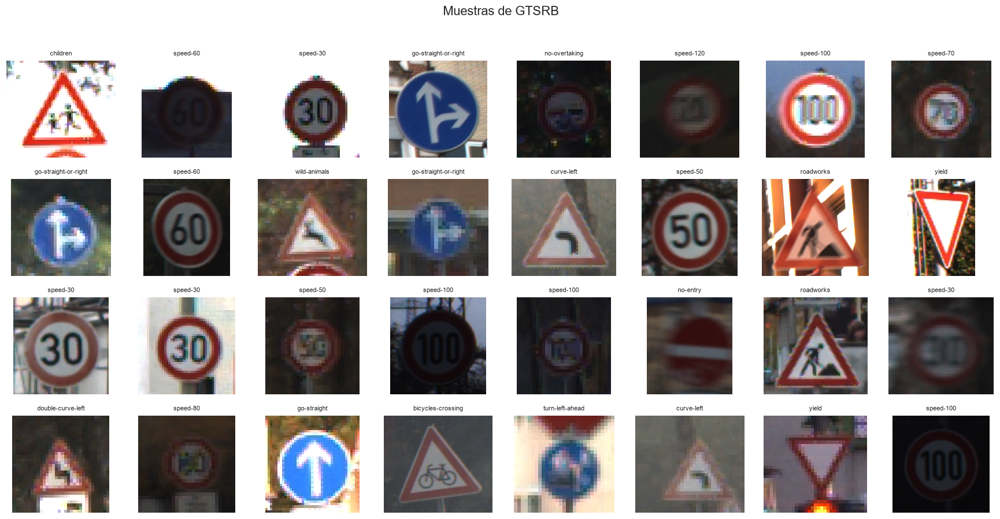

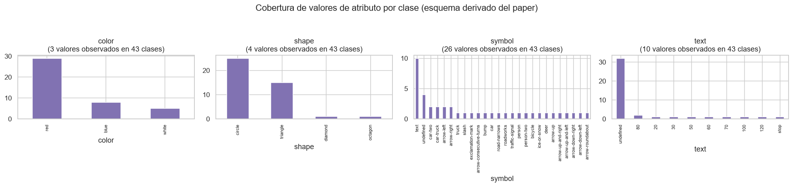

- **Color y Shape tienen baja cardinalidad efectiva** (dominados por `red`/`circle`
  y `red`/`triangle`) — muchas clases distintas comparten el mismo valor, por lo
  que son atributos **poco decisivos**.
- **Symbol y Text tienen alta cardinalidad** y son casi 1-a-1 con la clase dentro
  de cada grupo color+shape — son los atributos **decisivos**. Esto coincide
  exactamente con el hallazgo del paper: excluir Symbol o Text en inferencia causa
  una caída de exactitud mucho mayor que excluir Color o Shape (Sec. 5.3.2, Fig. 3).

---

## 3. CelebA

| | |
|---|---|
| Muestras | **202,599** (paper: 202,599 ✓) |
| Clases | **127** tras rebalanceo (paper: 127 ✓) |
| Atributos | 5 (`mouth`, `face`, `cosmetic`, `hair`, `appearance`), de 8 conceptos binarios seleccionados |
| Anotación | por instancia, **genuinamente multi-valuada** en `mouth` y `cosmetic` |

Se descargó solo `list_attr_celeba.txt` (26.7MB, 40 conceptos × 202,599 imágenes),
no las imágenes.

### 3.1 Selección de los 8 conceptos más balanceados

Replicando `celeba.py::computeAttributeBalanceScores` (score = \|#true − #false\|,
menor = más balanceado) sobre los 40 conceptos completos:

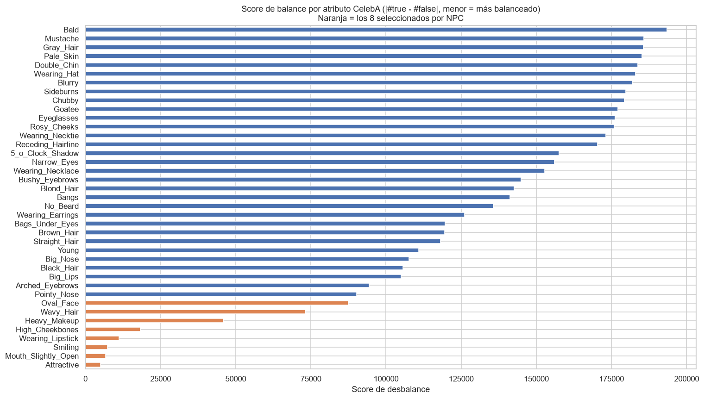

**Validación exacta:** los 8 conceptos con menor score de desbalance calculados
independientemente —`Attractive, Mouth_Slightly_Open, Smiling, Wearing_Lipstick,
High_Cheekbones, Heavy_Makeup, Wavy_Hair, Oval_Face`— **coinciden exactamente**
con los que el paper reporta haber seleccionado. Esto confirma que la
descripción metodológica del paper es reproducible directamente desde los datos
públicos.

### 3.2 Naturaleza multi-valuada

`mouth` y `cosmetic` agrupan 2 conceptos cada uno; `face` también. Un
porcentaje considerable de imágenes tiene **ambos** conceptos activos
simultáneamente:

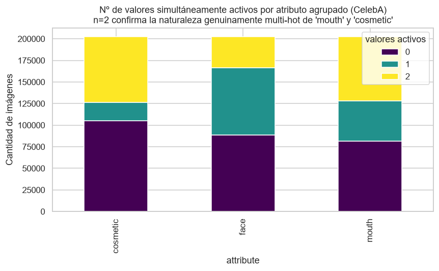

| Atributo | 0 activos | 1 activo | 2 activos (multi-hot) |
|---|---|---|---|
| `cosmetic` | 105,014 (51.8%) | 21,065 (10.4%) | **76,520 (37.8%)** |
| `face` | 88,760 (43.8%) | 77,922 (38.5%) | 35,917 (17.7%) |
| `mouth` | 81,339 (40.2%) | 46,909 (23.2%) | **74,351 (36.7%)** |

Más de un tercio de las imágenes tiene ambos conceptos de `cosmetic` (heavy-makeup
+ lipstick) y de `mouth` (mouth-slightly-open + smiling) activos a la vez —
confirmando que el `"multi_hot": true` explícito en la configuración del dataset
no es un caso marginal, sino un patrón frecuente que el pipeline de NPC convierte
a un vector de probabilidad uniforme (0.5/0.5) antes de entrenar
(`npc-models/dataset.py:83-91`).

### 3.3 Rebalanceo de clases (254 → 127)

Replicando `celeba.py::assignClasses` (agrupar por combinación de atributos,
ordenar por tamaño, emparejar el grupo más grande con el más pequeño, el segundo
más grande con el segundo más pequeño, etc.):

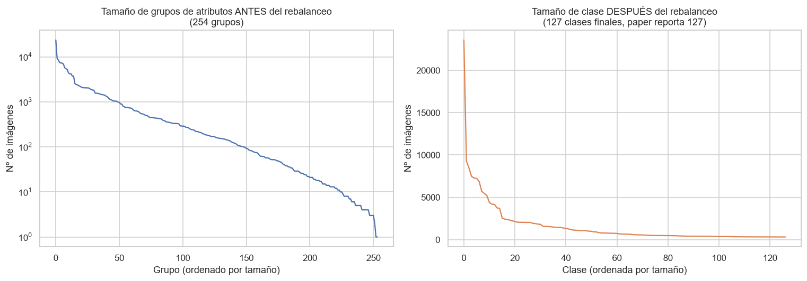

- **254 combinaciones de atributos únicas** antes del rebalanceo, con una
  distribución de cola muy larga: desde 1 imagen hasta 23,588 imágenes en un solo
  grupo (razón 23,588:1).
- El emparejamiento produce exactamente **127 clases finales**, coincidiendo con
  el paper.
- **Matiz no trivial:** el rebalanceo reduce el *número* de clases pero **no
  limita el tamaño máximo de clase** — el grupo más grande (23,588) se empareja
  con el grupo más pequeño (tamaño 1), quedando prácticamente igual de grande
  (23,589). El resultado final sigue siendo fuertemente desbalanceado (ver panel
  derecho), solo que con menos clases entre las que repartir la "cola larga" de
  combinaciones raras. Esto no contradice al paper (que dice "balancear... y
  aumentar la complejidad", no "igualar tamaños"), pero es un detalle relevante
  para diseñar el muestreo/ponderación de clases al entrenar KDM sobre este
  dataset.

---

## 4. AwA2 (Animals with Attributes 2)

| | |
|---|---|
| Muestras | 37,322 (paper: 37,322 ✓, no descargadas — solo metadatos) |
| Clases | **50** (paper: 50 ✓) |
| Atributos | 4 (`color`: 8, `surface`: 6, `body`: 9, `limb`: 6), de 29 de 85 predicados |
| Anotación | **por clase** (no por instancia) — toda la clase comparte el mismo vector de atributos |

Se descargó solo el paquete base (32KB: `classes.txt`, `predicates.txt`,
`predicate-matrix-binary.txt`), no las imágenes (13GB).

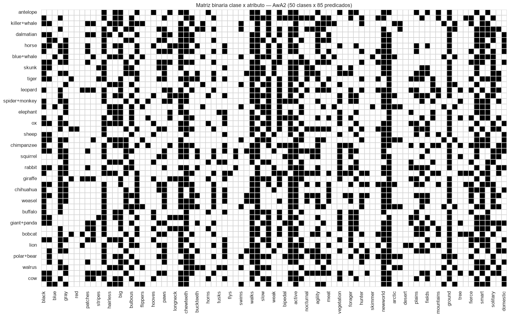

**Validación exacta:** de los 85 predicados originales, NPC conserva 29 (excluye
56 por ser no-visuales, de fondo o poco distintivos, p. ej. `fast`, `domestic`,
`desert`) agrupados en 4 atributos — los 29 nombres del código coinciden
exactamente con 29 columnas de la matriz oficial (`predicate-matrix-binary.txt`),
sin ninguna discrepancia de nombres.

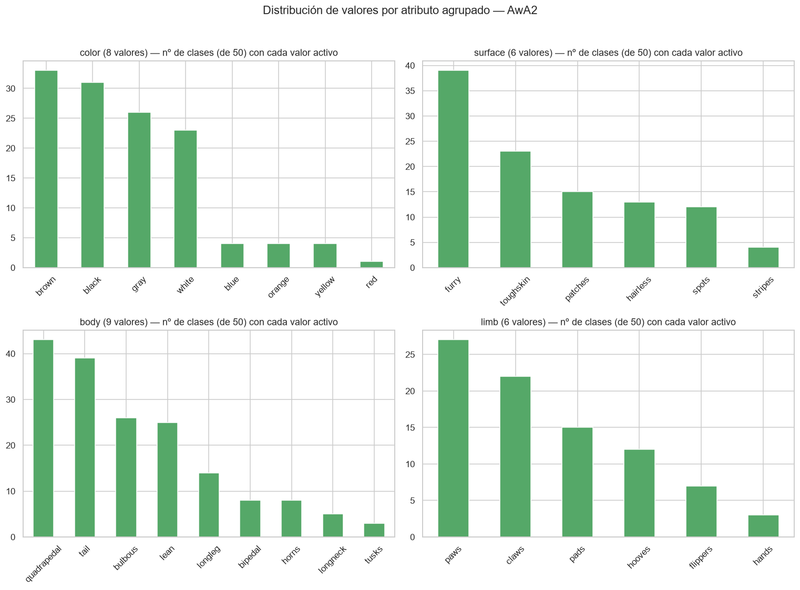

### Naturaleza multi-valuada (a nivel de clase)

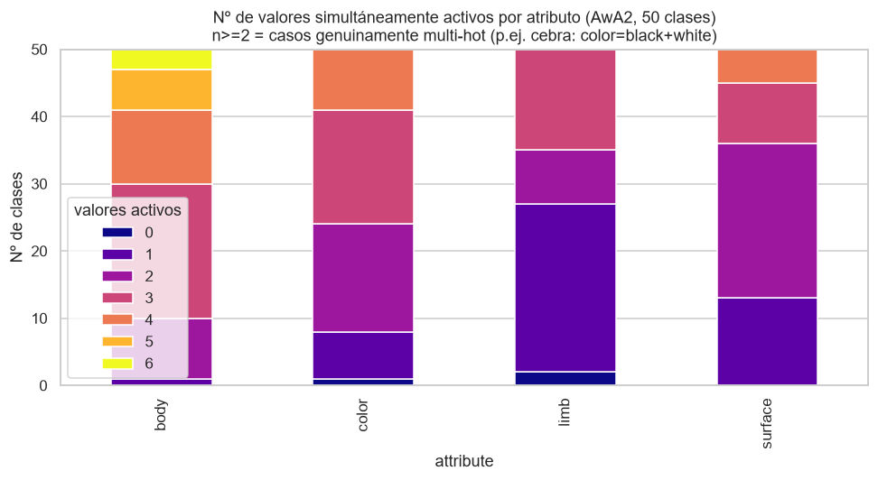

| Atributo | clases con 0 activos | 1 | 2 | 3+ |
|---|---|---|---|---|
| `color` | 1 | 7 | 16 | 26 |
| `surface` | 0 | 13 | 23 | 14 |
| `body` | 0 | 1 | 9 | 40 |
| `limb` | 2 | 25 | 8 | 15 |

- `body` es el atributo más "multi-hot": 40 de 50 clases tienen 3 o más rasgos
  corporales simultáneos activos (p. ej. un animal puede ser a la vez
  `quadrupedal`, `longleg` y `tail`).
- Validación directa del ejemplo del paper: la clase **zebra** tiene exactamente
  `color = {black, white}` activos — coincide byte a byte con el ejemplo citado en
  el texto del paper.

**Diferencia estructural clave vs. CelebA:** en AwA2 la anotación es **a nivel de
clase completa**, no de instancia — todas las imágenes de "cebra" heredan el
mismo vector de atributos exacto. Esto elimina el ruido de anotación por imagen,
pero implica que el encoder debe aprender a inferir una propiedad de la *clase*
a partir de instancias visualmente variadas (pose, iluminación, fondo), a
diferencia de MNIST-Addition, donde el atributo depende directa y únicamente de
los píxeles observados en esa instancia particular.

---

## 5. Resumen comparativo

| Dataset | Muestras | Clases | Atributos | Valores/atributo (prom.) | Anotación | Multi-valuado |
|---|---|---|---|---|---|---|
| MNIST-Addition | 35,000 | 19 | 2 | 10.0 | instancia | no |
| GTSRB | 39,270 | 43 | 4 | 10.75 | clase (derivado del paper) | no |
| CelebA | 202,599 | 127 | 5 | 2.0 | instancia | sí (mouth, cosmetic) |
| AwA2 | 37,322 | 50 | 4 | 7.25 | clase | sí (los 4 atributos) |

(`dataset_summary.csv` contiene esta tabla en formato procesable.)

## 6. Implicaciones para el diseño de la comparación KDM vs NPC

1. **Los datasets cubren un espectro deliberado de dificultad de "cuello de
   botella semántico"**: MNIST-Addition (atributos limpios, instancia,
   perfectamente decisivos) → GTSRB (atributos con cardinalidad muy dispar,
   decisivos vs. no decisivos) → CelebA (multi-valuado, alto desbalance de
   clases) → AwA2 (multi-valuado extremo, anotación a nivel de clase). Un
   experimento KDM-vs-NPC que solo use MNIST-Addition subestimaría las
   dificultades reales del cuello de botella de atributos.
2. **La conversión multi-hot → probabilidad uniforme (Eq. 2 de NPC) es
   necesaria y no trivial**: más de un tercio de CelebA y la mayoría de las
   clases de AwA2 dependen de ella. Como ya se documentó en la discusión
   KDM-vs-NPC previa, `KDMLayer.forward` de `kdm-torch` ya acepta esta
   representación distribucional de forma nativa — este EDA confirma
   cuantitativamente que esa capacidad **sí se necesitará** en la práctica,
   no es un caso de borde.
3. **El desbalance de clases de CelebA no se resuelve del todo con el
   rebalanceo** (Sección 3.3) — cualquier comparación de exactitud KDM vs NPC en
   CelebA debería reportar métricas balanceadas (p. ej. macro-F1) además de
   accuracy cruda, o el resultado puede estar dominado por la clase de 23,589
   imágenes.
4. **AwA2's anotación a nivel de clase** cambia el problema de aprendizaje del
   encoder: no está prediciendo un atributo de la instancia observada
   directamente, sino una propiedad heredada de la clase — relevante al diseñar
   qué tan "acoplado" debe estar el encoder de KDM a la tarea de atributos vs. a
   la de clasificación final.
